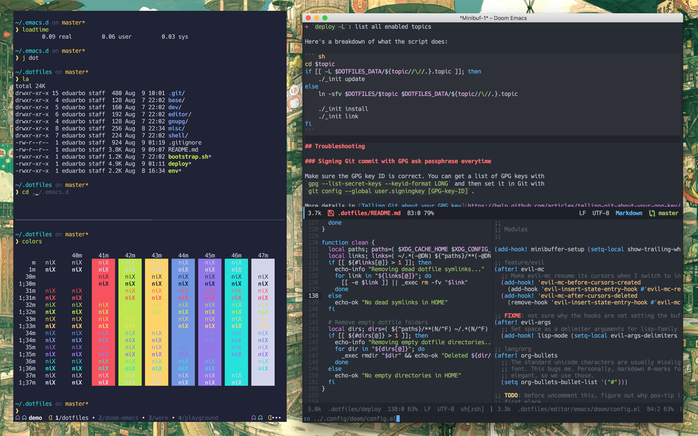

# 🚨 DEPRECATED 🚨
These dotfiles are no longer supported, I have moved everything to a [new
repo](https://github.com/eduarbo/dotfiles) for a fresh start.

---

# Mein dotfiles

A tidy `$HOME` is a tidy mind.




These are my dotfiles, designed primarily for macOS and Fedora, heavily inspired
by [hlissner/dotfiles](https://github.com/hlissner/dotfiles). They are my
specific breed of madness, split into 2-level topics (e.g. `shell/zsh`) that
strive for minimum `$HOME` presence (adhering to XDG standards where possible).

## Quick start

`bash <(curl -s https://raw.githubusercontent.com/eduarbo/dotfiles/master/bootstrap.sh)`

## What does it include?

The following are the categories and topics available to install:

```
.
├── assets/              # Mostly images
│   └── wallpapers/      ## love details and easter eggs
|
├── base/                # Provisions my system with the bare essentials
│   ├── macos/           ## bare essentials for macOS
│   └── fedora/          ## bare essentials for Wind... err, Fedora
|
├── dev/                 # Relevant to software development & programming in general
│   ├── lua/             ## manage lua environments with luaenv
│   ├── python/          ## setup pyenv, a simple Python version management
│   └── node/            ## setup nodenv, a lightweight alternative to nvm
|
├── editor/              # Configuration for my text editors
│   ├── editorconfig/    ## maintain consistent coding styles between different editors
│   └── emacs/           ## the best of both the Emacs and Vim worlds
|
├── misc/                # For various apps & tools
│   ├── apps/            ## macOS apps and utilities
│   ├── cvim/            ## Vim-like bindings for Google Chrome
│   ├── hammerspoon/     ## a bunch of lua scripts for macOS to boost my productivity
│   ├── iterm/           ## iTerm2, is there a better macOS terminal?
│   └── karabiner/       ## absolutely amazing macOS app that lets me remap completely my keyboard
│
└── shell/               # Shell utilities
    ├── bash/            ## Not my default shell but doesn't hurt to have a basic config
    ├── git/             ## nice aliases and zsh plugins
    ├── sk/              ## faster than fzf, Skim it's Fuzzy Finder in rust!
    ├── tmux/            ## window manager within the terminal + nice plugins
    └── zsh/             ## My shell of choice with a nice prompt, really fast and extensible with zplugin
```

## Dotfile management

```
Usage: deploy [-acdlLit] [TOPIC...]

  -a   Target all enabled topics (ignores TOPIC args)
  -c   Afterwards, remove dead symlinks & empty dot-directories in $HOME.
       Can be used alone.
  -d   Unlink and run `./_init clean` for topic(s)
  -l   Only relink topic(s) (implies -i)
  -L   List enabled topics
  -i   Inhibit install/update/clean init scripts
  -t   Do a test run; do not actually do anything
```

e.g.
+ `deploy base/macos shell/{zsh,tmux}`: enables base/macos, shell/zsh & shell/tmux
+ `deploy -d shell/zsh`: disables shell/zsh & cleans up after it
+ `deploy -l shell/zsh`: refresh links for shell/zsh (inhibits init script)
+ `deploy -l`: relink all enabled topics
+ `deploy -L`: list all enabled topics

Here's a breakdown of what the script does:

``` sh
cd $topic
if [[ -L $DOTFILES_DATA/${topic//\//.}.topic ]]; then
    ./_init update
else
    ln -sfv $DOTFILES/$topic $DOTFILES_DATA/${topic//\//.}.topic

    ./_init install
    ./_init link
fi
```

## Troubleshooting

### Signing Git commit with GPG ask passphrase everytime

Make sure the GPG key ID is correct. You can get a list of GPG keys with
`gpg --list-secret-keys --keyid-format LONG` and then set it in Git with
`git config --global user.signingkey [GPG-key-ID]`.

More details in [Telling Git about your GPG key](https://help.github.com/articles/telling-git-about-your-gpg-key/).

## Relevant projects

+ [DOOM Emacs](https://github.com/hlissner/doom-emacs) (pulled by `editor/emacs`)
+ [Pacmux Tmux theme](https://github.com/eduarbo/pacmux) (pulled by `shell/tmux`)
+ [Simpl ZSH prompt](https://github.com/eduarbo/simpl) (pulled by `shell/zsh`)
